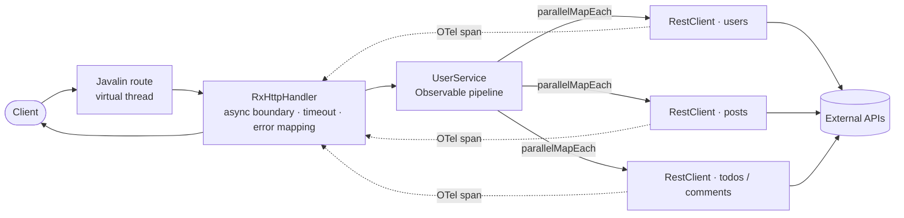

<div align="center">

# ⚡ Javalin API

**A high-performance, fully reactive Java REST API — built on virtual threads, RxJava 3, and a cloud-native toolchain.**

[](https://github.com/arielsrv/javalin-api/actions/workflows/maven.yml)
[](https://github.com/arielsrv/javalin-api/actions/workflows/docker-image.yml)
[](https://opensource.org/licenses/MIT)


</div>

---

## Overview

`javalin-api` is a compact reference for a **non-blocking** REST service on the modern JVM. Every request runs on a
[Javalin](https://javalin.io/) virtual thread, is orchestrated end-to-end with **RxJava 3**, and fans out to external
APIs concurrently without ever blocking a thread. Guice wires the graph, OpenTelemetry traces it, and Prometheus
measures it.

> The `/users` endpoint is the showcase: it fetches users, then for each user fans out to posts, todos and (nested)
> comments — **dozens of upstream calls in parallel** — and assembles the response while preserving input order.

## ✨ Highlights

|                              |                                                                                                                                               |
|------------------------------|-----------------------------------------------------------------------------------------------------------------------------------------------|
| 🧵 **Virtual threads**       | Loom-based concurrency (`useVirtualThreads`) — a thread per request, cheap to block, never blocked.                                           |
| 🔀 **Reactive fan-out**      | `RxOperators.parallelMapEach` maps a list to N async calls and subscribes them all at once, order-preserving.                                 |
| 🛡️ **Resilient HTTP bridge** | `RxHttpHandler` bridges RxJava ↔ Javalin async: per-request **timeout → `504`**, null-safe error bodies, subscription disposal on disconnect. |
| 💉 **Dependency injection**  | Google Guice with dynamic, config-driven `RestClient` bindings.                                                                               |
| 🔭 **Observability**         | Distributed tracing (OpenTelemetry agent) + Micrometer/Prometheus metrics, low-cardinality span names.                                        |
| 📖 **Live API docs**         | OpenAPI 3 generated from annotations, served via Swagger UI and ReDoc.                                                                        |
| 🧩 **One JSON contract**     | A single shared, immutable `ObjectMapper` (snake_case, `java.time`) used by both serialization and clients.                                   |
| 🚢 **DevOps ready**          | Multi-stage Docker build, Kustomize manifests, and a `Taskfile` for one-command workflows.                                                    |

## 🧱 Tech stack

| Layer         | Choice                                       | Version |
|---------------|----------------------------------------------|---------|
| Language      | Java (Temurin)                               | **25**  |
| Web framework | Javalin                                      | 7.2.2   |
| Reactive      | RxJava                                       | 3.1.12  |
| DI            | Google Guice                                 | 7.0.0   |
| JSON          | Jackson                                      | 2.22.1  |
| Metrics       | Micrometer + Prometheus                      | 1.17.0  |
| Tracing       | OpenTelemetry agent                          | 2.30.0  |
| Tests         | JUnit 5 · Mockito · AssertJ · Testcontainers | —       |

## 🔁 How a request flows



- **`RxHttpHandler.intercept`** — opens Javalin's async boundary, subscribes the `Observable`, and maps outcomes:
  value → `200`, empty → `404`, error → `500`, timeout → `504`. It never blocks and always completes the response future
  (even when an exception has no message).
- **`RxOperators.parallelMapEach`** — the reusable RxJava operator (`.compose(...)`) behind the fan-out: it turns
  `Observable<List<T>>` into concurrent per-item calls via `concatMapEager`, keeping input order.
- **`RestClient`** — non-blocking `HttpClient` calls wrapped in `Observable.defer` + `fromCompletionStage`, each in its
  own OpenTelemetry span, deserializing with the shared `ObjectMapper`.

## 🚀 Quick start

### Requirements

- **Java 25** (Temurin recommended) · **Maven 3.9+**
- **Docker** + Buildx *(for containers)*
- [**Task**](https://taskfile.dev/) *(optional, recommended)* · `kubectl`, `kustomize`, `mkcert` *(for Kubernetes)*

### Run it

```sh
# Build (Maven wrapper — no local Maven needed)
./mvnw clean package

# Run
java -jar target/app.jar
# → API on http://localhost:8081
```

<details>
<summary><b>With Task</b> (recommended)</summary>

```sh
task build          # Build the project (skipping tests)
task docker:debug   # Build the Docker image locally
task docker:run     # Run the application in Docker
```

</details>

<details>
<summary><b>With Docker</b> directly</summary>

```sh
docker build -t javalin-api:latest --build-arg JAVA_VERSION=25 .
```

</details>

## 🌐 API endpoints

Base URL: `http://localhost:8081`

| Method | Path       | Description                                             |
|--------|------------|---------------------------------------------------------|
| `GET`  | `/users`   | Reactive fan-out: users + their posts, todos & comments |
| `GET`  | `/ping`    | Health check (`pong`)                                   |
| `GET`  | `/metrics` | Prometheus metrics (text exposition format)             |
| `GET`  | `/swagger` | Interactive Swagger UI                                  |
| `GET`  | `/redoc`   | ReDoc documentation                                     |
| `GET`  | `/openapi` | OpenAPI 3.0 spec (JSON)                                 |

```sh
curl http://localhost:8081/users | jq
```

## ⚙️ Configuration

Environment-based — files live in `src/main/resources/config/config.{env}.properties`.

| Key                            | Description                                                   | Default                         |
|--------------------------------|---------------------------------------------------------------|---------------------------------|
| `app.port`                     | API port                                                      | `8081`                          |
| `app.host`                     | Bind host                                                     | `127.0.0.1` (`0.0.0.0` in prod) |
| `rest.client.{name}.base.url`  | Registers a named `RestClient` (bound dynamically at startup) | —                               |
| `http.request.timeout.seconds` | Hard per-request ceiling; on expiry the handler returns `504` | `30`                            |

## 🔭 Observability

The **OpenTelemetry Java Agent** provides distributed tracing out of the box. Span names are kept low-cardinality (e.g.
`GET /public/v2/users/{id}/posts`), and each retry/subscription opens its own span. Configure via environment variables
(see `Dockerfile` / `Taskfile.yml`):

| Variable                      | Purpose            | Default       |
|-------------------------------|--------------------|---------------|
| `OTEL_EXPORTER_OTLP_ENDPOINT` | Target collector   | Tempo         |
| `OTEL_SERVICE_NAME`           | Service identifier | `javalin-api` |

Prometheus metrics (JVM, process, GC, threads, disk) are exposed at `GET /metrics`.

## 🧪 Testing

JUnit 5 + Mockito + AssertJ, with reactive assertions via RxJava's `TestObserver` and HTTP tests against
`MockWebServer`. JaCoCo coverage is generated under `target/site/jacoco`.

```sh
./mvnw test
```

## 🔒 Dependencies & security

Keep the dependency tree current and audited via `Taskfile` shortcuts:

| Task | Action |
|---|---|
| `task deps:updates` | List available dependency & plugin updates (pre-releases filtered out) |
| `task deps:check` | Scan for known vulnerabilities with OWASP dependency-check (NVD) |

```sh
task deps:updates                    # what can be upgraded?
NVD_API_KEY=<key> task deps:check    # any known CVEs? (key avoids NVD rate limiting)
```

## 🚢 Kubernetes

Deploy the whole stack with one command:

```sh
task k:run
```

This builds the image, renders manifests with Kustomize, creates the namespace and TLS secrets (via `mkcert`), applies
the deployment and waits for rollout. Useful sub-tasks:

| Task           | Action                                     |
|----------------|--------------------------------------------|
| `task k:tls`   | Generate & apply TLS secrets for Ingress   |
| `task k:apply` | Apply manifests and restart the deployment |
| `task k:ping`  | Ping the service through the Ingress       |

## 📁 Project structure

```text
src/main/java/com/arielsrv
├── Main.java            # Entry point: wires Guice, registers routes, starts server
├── controllers          # REST endpoints (OpenAPI-annotated)
├── services             # Business logic & reactive orchestration (UserService)
├── clients              # Typed REST clients + response records
├── dto                  # Data Transfer Objects (records)
├── core                 # Server, RxHttpHandler, RxOperators, RestClient, config, DI registry
├── providers            # Guice providers (ObjectMapper, Config)
└── modules              # Guice module (AppModule)

src/main/resources
├── config               # Per-environment .properties
└── kubernetes           # Kustomize manifests

Dockerfile               # Multi-stage build (Java 25)
Taskfile.yml             # Task automation
pom.xml                  # Maven dependencies
```

## 📜 License

Released under the **MIT License** — see [`LICENSE`](LICENSE) for details.
